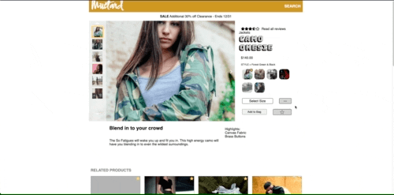
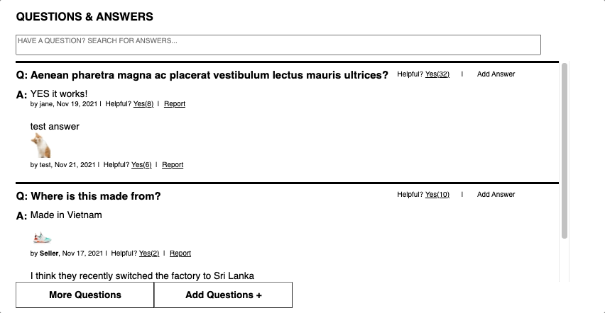
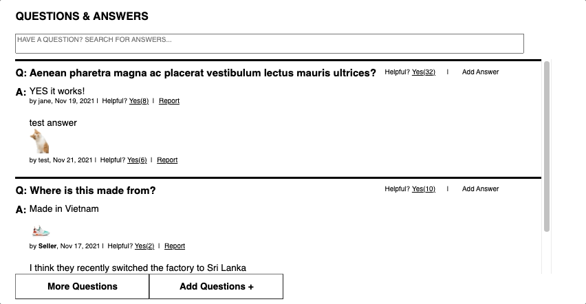

# 🌭 Mustard 🌭

Have you ever wanted to view the ins and outs of a random clothing product without being able to navigate anywhere else in the website? Well, Team Mustard brings you Mustard, a true single page shopping experience.

## Description

Mustard is a project developed by Hack Reactor, a software engineering boot-camp, that pushed the boundaries of our front-end knowledge. Throughout this endeavor, we as a team of four, increased our proficiency with React, CSS, testing, front-end optimization, and other concepts/tools. A third party API hosted by Hack Reactor provides the data we need to display and we use these resources to build the features and content for a robust, familiar, and enjoyable user experience.

## Modules and Related Features

### 1. Product Overview
**Purpose:**

*Feature A:*
* Description
* GIF

### 2. Related Products and Outfit
**Purpose:** Allow user to navigate to and view related products in a digestable format, compare features between each related product and the main product, and add products to the outfit list to be saved even after the session ends.

*Dynamic Product Cards*

Every product has associated related products (determined by Hack Reactor's API) that are dynamically rendered in a scrollable list. Navigation buttons appear on each side of the list based on scroll bar location and presence of additional products on the corresponding side.

*Dynamic Comparison Modal*
* Description
* GIF

*Save Products with the Outfit List*
* Description
* GIF

### 3. Questions & Answers
**Purpose:**
The Questions & Answers module allows asking and answering of questions for the product selected.

The functionality contained within this module can be divided into several pieces:
* View questions
* Search for a question
* Asking a question
* Answering a question

This component extends the ability to view and search questions, ask questions, answer questions and provide feedback on questions about the current product.

*View Questions*
* At the center of the Questions and Answers module is a list of questions that have been asked about the given product.
* The questions and their corresponding answers within this list are displayed in an expanding and collapsing accordion. By default, two questions are displayed. Up to two answers are displayed for each question. The remaining questions or answers are hidden until the user loads them using the “More Questions” button.
* Questions appear in order of ‘helpfulness’, corresponding to how many users have indicated that the question was helpful.
* The list contains all questions by default, but can be filtered to a subset based on user searches.
* If no questions have been submitted for this product, then the list collapses and the button to submit a new question appears near the top of the module.

*Search Question*
* Search terms entered in the search bar filters the question list for matching results.
* After the user types 3 or more characters into the search bar the results will begin to filter to only those containing matching text. The filter continues to update as the user adds or removes characters.
* If the user clears the search term, or removes characters so that less than 3 remain, the list returns to the state where it is not filtered to matching text.
* The search filter works with any other filters or sorts that have been applied, and narrows the results further.

*Ask Question*
* At the bottom of the Questions & Answers module, the 'Add Questions +' button allows users to create a new question for the product.
* Upon clicking the button a modal window opens, overlaying the product page.
* Upon selecting the 'Submit Question' button the form’s inputs are validated. If there are any invalid entries, the submission is prevented, and a warning message appears.

*Answer Question*
* Through the link provided on each question within the Questions list, users are allowed to submit an answer for the product.
* Upon clicking the button a modal window opens, overlaying the product page.
* Users can upload up to five photos for each answer.
* Upon selecting the 'Submit Answer' button the form’s inputs are validated. If there are any invalid entries, the submission is prevented, and a warning message appears.

### 4. Reviews & Ratings
**Purpose:**

*Feature A:*
* Description
* GIF

## Team Members
* **[Michael Lapid](https://github.com/addessosf)**
* **[Julie Yu](https://github.com/xoxohorses)**
* **[Michael Lee](https://github.com/msilee85)**
* **[Joey Dowling](https://github.com/jdowling55)**
